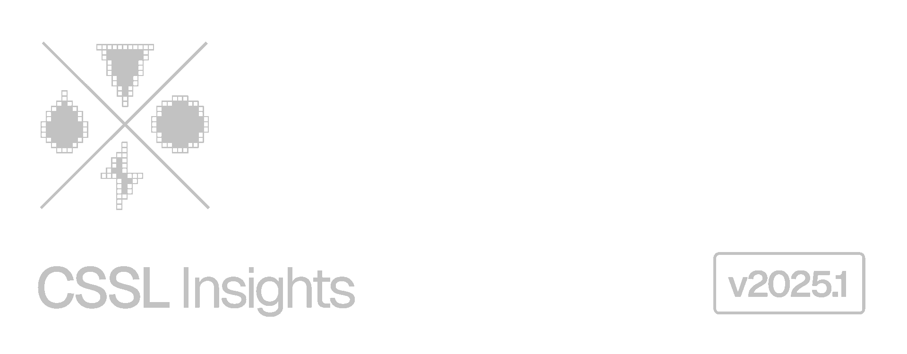
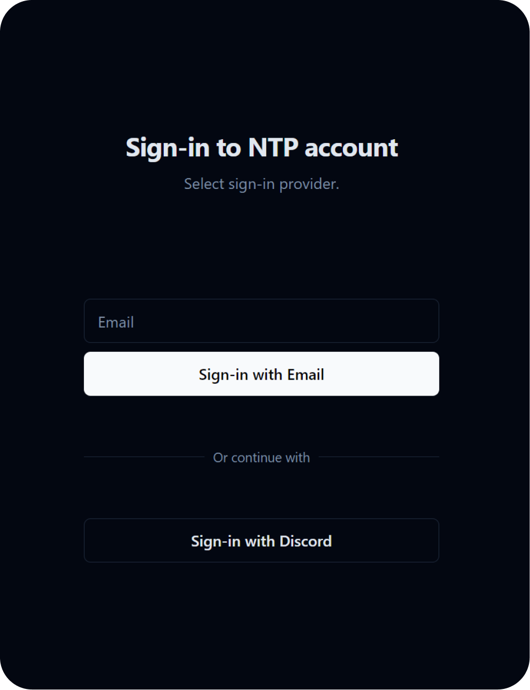
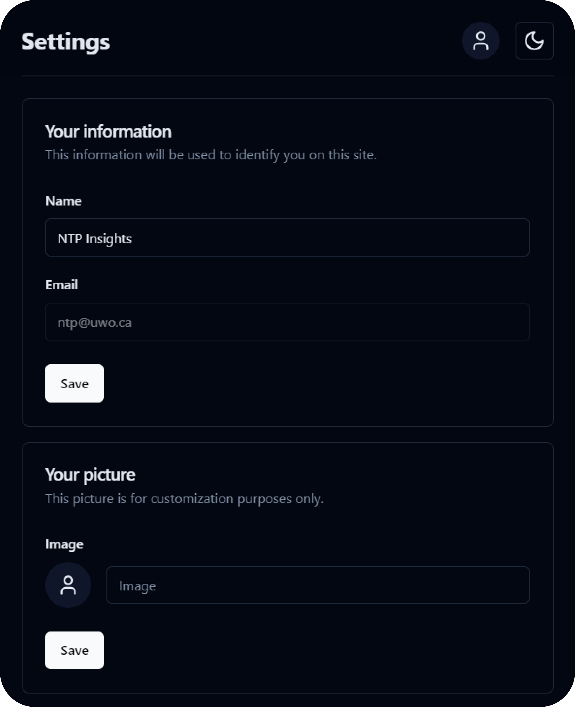
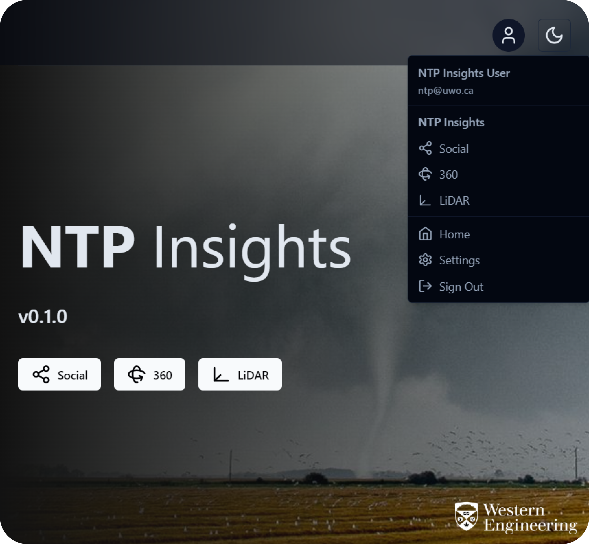

## About

**CSSL Insights** is a web application platform developed by research students to support the <a href="https://www.uwo.ca/ntp/">Canadian Severe Storms Lab</a>'s capacity in collecting, analyzing, and sharing important research data in a meaningful way.

## Tools

[**NTP 360**](docs/NTP_360.md) - Damage survey VR panorama viewer 
[**NTP LiDAR**](docs/NTP_LIDAR.md) - Damage survey LiDAR point cloud viewer 
[**NTP Social**](docs/NTP_SOCIAL.md) (no longer maintained) - Social media scraping 
[**NHP Hailgen**](docs/NHP_HAILGEN.md) - Automated hailpad dent analysis

## Accounts

> `01` **Sign-in Process**

Users can create an CSSL Insights account using one of two methods: by entering their email address or by linking their Discord account. If using an email address, a verification email will be sent with a link to proceed. If using a Discord account, a pop-up will prompt the user to authorize the account.

> `02` **Account Customization**

Upon initial account creation, the user will be prompted to set their profile settings, including their name and profile picture (optional). Profile settings can be accessed at any time through the main dropdown in the top right corner of the screen.

> `03` **Authentication**

For full access to the CSSL Insights feature set, a user must be `CSSL Authenticated`. Any currently authenticated user can authenticate other users by navigating to `Settings > Authenticate Users`.

> `04` **Main Dashboard and Navigation**

The main dashboard provides quick access to the three CSSL Insights software tools. The navigation bar at the top persists on every CSSL Insights page and includes a main dropdown with access to all CSSL Insights pages and a button to configure the website theme.

