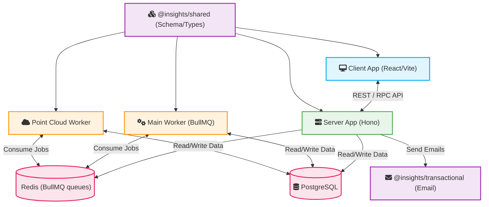

# System Architecture

The Insights application is organized as a monorepo containing client applications, server APIs, background workers, and shared packages. It coordinates severe storms research tools like NTP 360, NTP LiDAR, and NHP Hailgen.

## Monorepo Structure

- **Apps** (`/apps`):
  - `@insights/client`: A React SPA built with Vite, utilizing Three.js and Potree for 3D visualization.
  - `@insights/server`: A Node.js API server built with Hono.
  - `@insights/worker`: A BullMQ background worker handling general tasks (e.g., blurring, Google Maps processing, hailpad analysis, depth maps).
  - `@insights/worker-point-cloud`: A specialized background worker dedicated to resource-intensive LiDAR point cloud processing using `PotreeConverter`.
- **Packages** (`/packages`):
  - `@insights/shared`: Contains shared Drizzle ORM database schemas, standard queue definitions (BullMQ), utilities, and TypeScript types used across all apps.
  - `@insights/transactional`: Manages transactional emails using Resend.

## Architecture Diagram

## Tech Stack Overview
- **Frontend**: React, Vite, Three.js, React-Three-Fiber, Potree Core, TailwindCSS, Radix UI.
- **Backend**: Hono, Drizzle ORM, Better Auth, BullMQ, Zod.
- **Data Layers**: PostgreSQL (primary store), Redis (job queues and caching).
