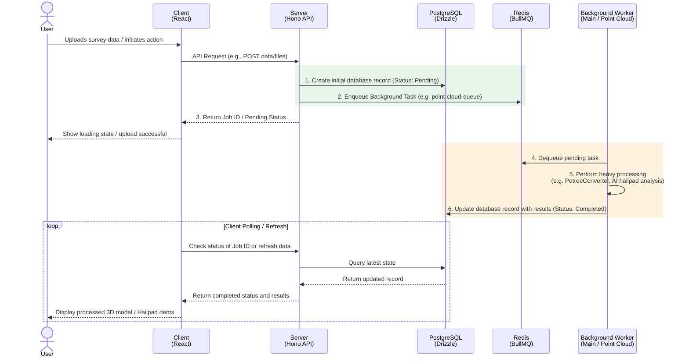

# Data Flow

This document illustrates how data moves through the Insights application, particularly focusing on background processing tasks which form the core of the severe storm analysis features.

## General Job Processing Flow

Below is the standard sequence for how the system handles heavy processing operations (e.g., point cloud processing, image blurring, or hailpad analysis):

## Queue Specializations

The `Server` delegates workloads into specific Redis queues managed by the `@insights/shared` package. These queues dictate which worker nodes pick up the data:

1. **`point-cloud-queue`**: Exclusively consumed by `@insights/worker-point-cloud`. Used to parse raw LiDAR `.las`/`.laz` files into OGC 3D Tiles / Potree formats.
2. **`hailpad-analysis-queue`**: Consumed by `@insights/worker`. Uses AI/CV tools to classify dents on uploaded hailpad models.
3. **`blur-queue`**: Consumed by `@insights/worker`. Handles privacy blurring algorithm execution for 360-degree street-view panoramas.
4. **`depth-map-queue`** & **`google-queue`**: Additional processing queues within the main worker instance.
