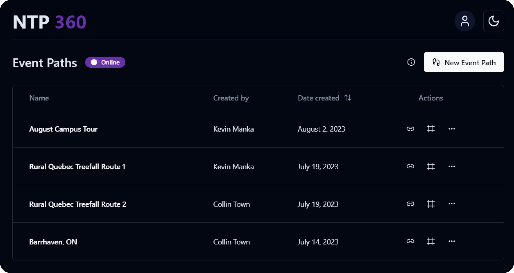
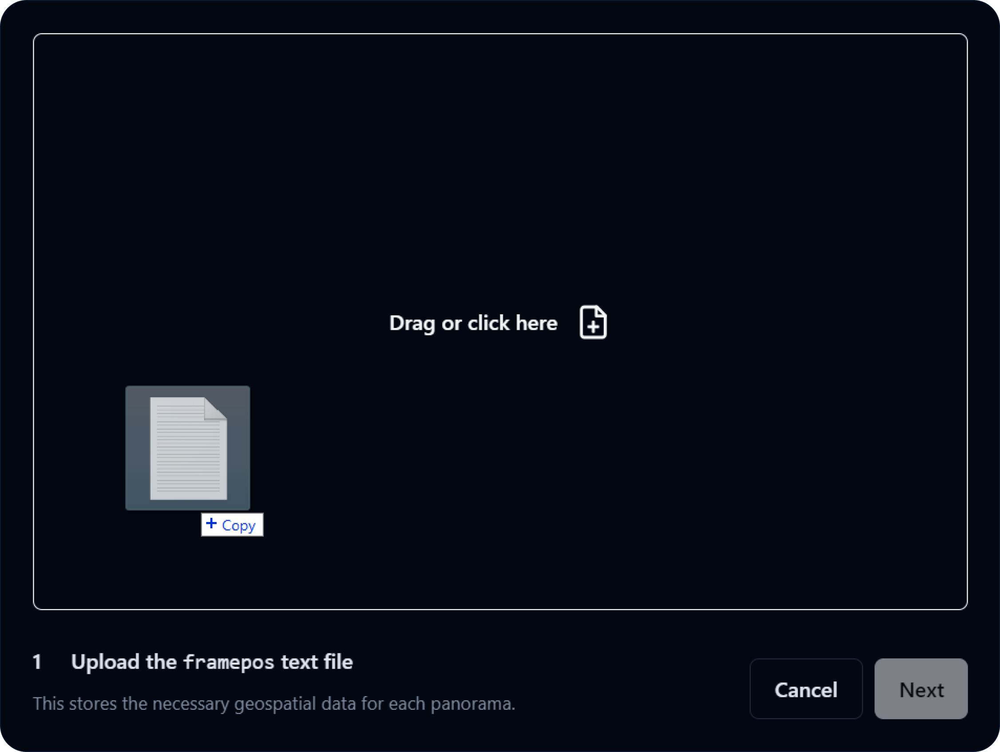
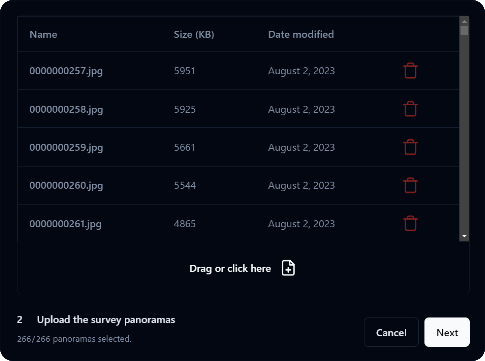
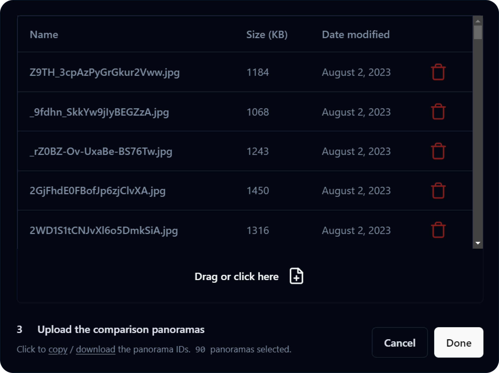
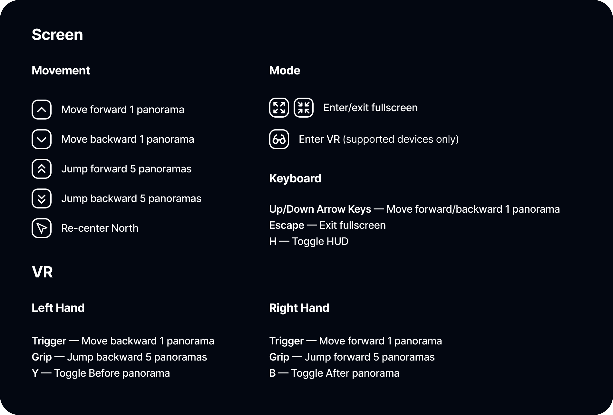
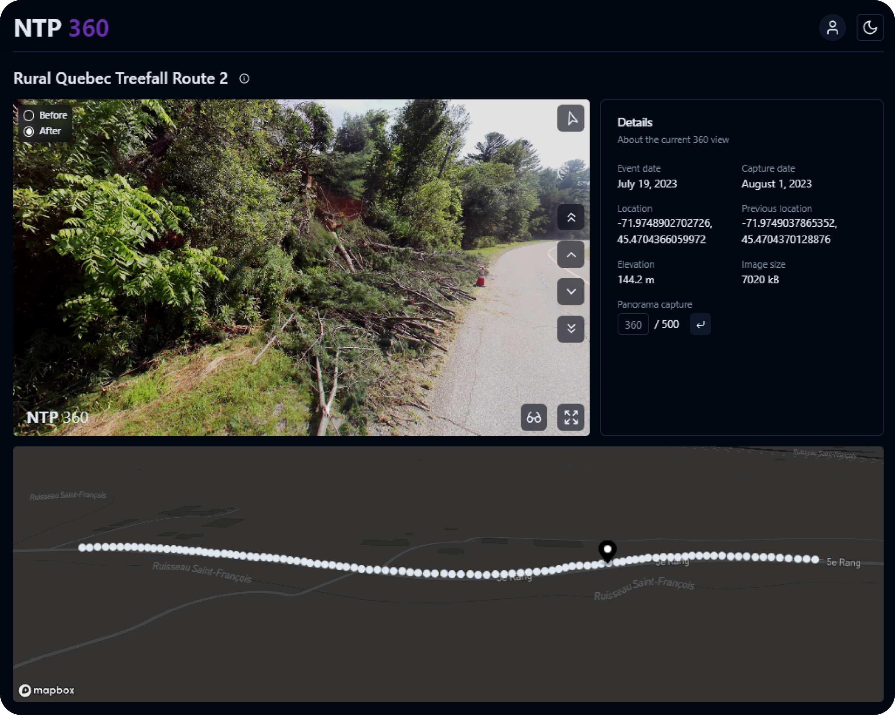

## NTP 360

NTP 360 enables the uploading, viewing, and sharing of 360-degree panorama captures taken on severe storm damage surveys on-screen and in virtual reality (VR) using `React Three XR` (based on `WebXR`). Users can move through and around the street-level imagery and toggle between `Before` and `After` to compare changes that occurred from the storm.

> `01` 360 Dashboard

The 360 dashboard allows users to create a new event path upload and access the table of pre-existing uploads.

> `02` Uploading New Event Paths

After providing event details such as the event name, folder name, and date, the upload process is broken into 3 distinct uploads: the `framepos.txt` file, the event panoramas, and the comparison panoramas.

**_Uploading the framepos file._** NTP 360 is designed around the `NCTech iSTAR Pulsar` camera workflow. Once data formation through `NCTech Immersive Studio` is complete, a `framepos` text file is created, storing all of the necessary geospatial data for each photo. NTP 360 parses this data and uses it to plot map points, populate a `Details` pane alongside the 360 view, and more.

**_Uploading the event panoramas._** After counting the number of data entries in the `framepos.txt` file, NTP 360 determines the number of panoramas that it expects to be uploaded. Note that only numerically chronological file names, i.e., `0000000000`, `0000000001`, `0000000002`, etc. are accepted.

**_Uploading the comparison panoramas._** NTP 360 references the latitude and longitude values for each panorama and uses the `Google Street View API` to fetch the closest available panorama for each of the uploaded `iSTAR Pulsar` panoramas. A copyable/downloadable list of panorama IDs is then given to be entered into `Street View Download 360` for exporting. Note that each comparison panorama file must be named after its panorama ID.

> `03` Viewing Event Path Uploads (Screen and VR)

NTP 360 uses `Three.js` to create a spherical texture map view of each panorama and `CameraControls` to look around the view. The following are the controls for the 360 view:

Alongside the 360 view is a `Details` pane that offers useful information about the panorama and more granular sequence controls. There is also an interactive map powered by the `Mapbox API` that plots a clickable point for every 5 images along the event route.

> `04` Sharing Event Path Uploads

From the 360 dashboard, users can copy a shareable public link that leads directly to its associated event path upload. An inline frame of the 360 view can also easily be embedded onto other webpages.

> `05` Additional Resources

[Click here](CAMERA.md) to learn more about using the `iSTAR Pulsar camera` and `Street View Download 360`.