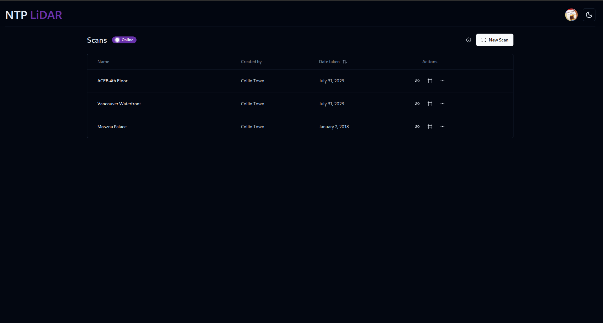
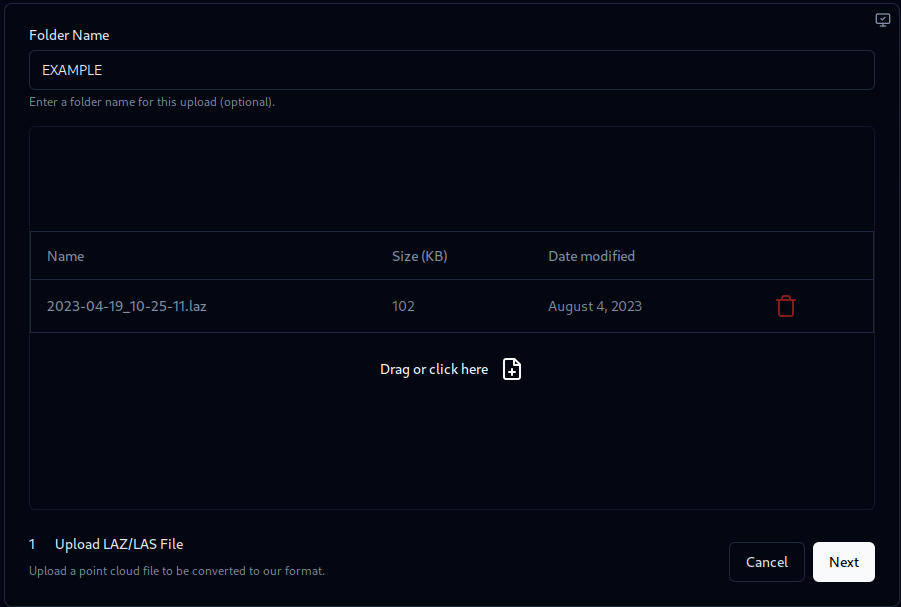
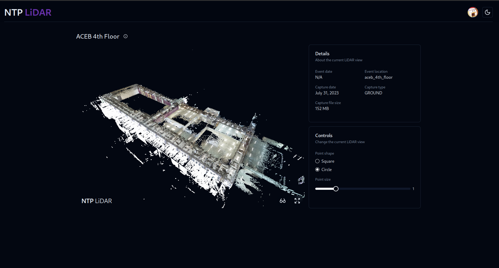
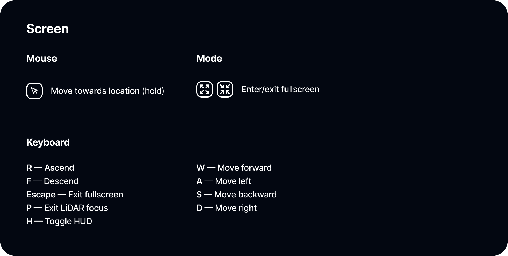

## NTP LiDAR

Another way to capture visual data from a storm survey is in the form of LiDAR pointclouds. In conjunction with images from ground/aerial photography, LiDAR data can be used to identify failure modes of natural and man-made structures.

NTP LiDAR is a way to quickly view LiDAR pointcloud scans without having to download a standalone program. Just upload your `.las` or `.laz` file and you're off to the races!

> `01` LiDAR Dashboard

The LiDAR dashboard allows users to create a new scan upload and access the table of pre-existing uploads.

> `02` Uploading New Scans

The upload dialog requires the user to upload the pointcloud file(s) in the `*.las` format or its compressed variant, `*.laz`. As a part of the upload process, metadata relating to scan/event dates, scan location, and scan type (e.g. ground vs. aerial) are required to be entered in.

After the upload process is completed, the backend automatically converts this to a binary format that the renderer can use.

**_Speaking of which..._**

> `03` Viewing Scan Uploads

The LiDAR pointclouds are rendered using `Potree Core` which is a simplifed library of the venerable `Potree` software. As such, the core foundation of the renderer is built around `THREE.js`. To move the camera around the pointcloud, a combination of `FlyControls` and `PointerLockControls` is used to provide cursor and keyboard control.

Such controls are further detailed in the graphic below:

> `04` Sharing Scan Uploads

Just like with the 360 dashboard, users can copy a shareable public link that leads directly to its associated LiDAR scan entry. An inline frame of the pointcloud view can also easily be embedded onto other webpages.