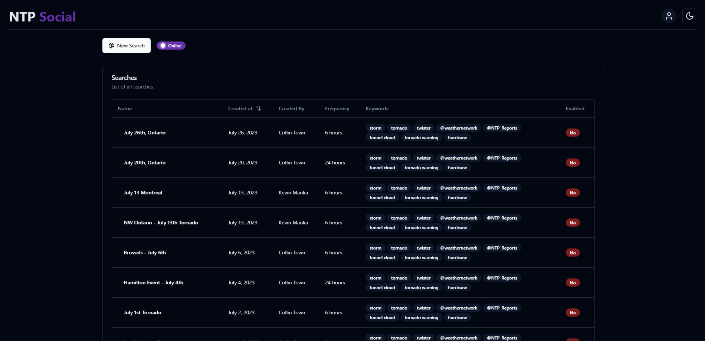
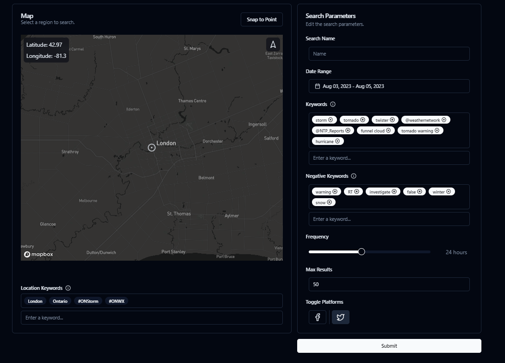
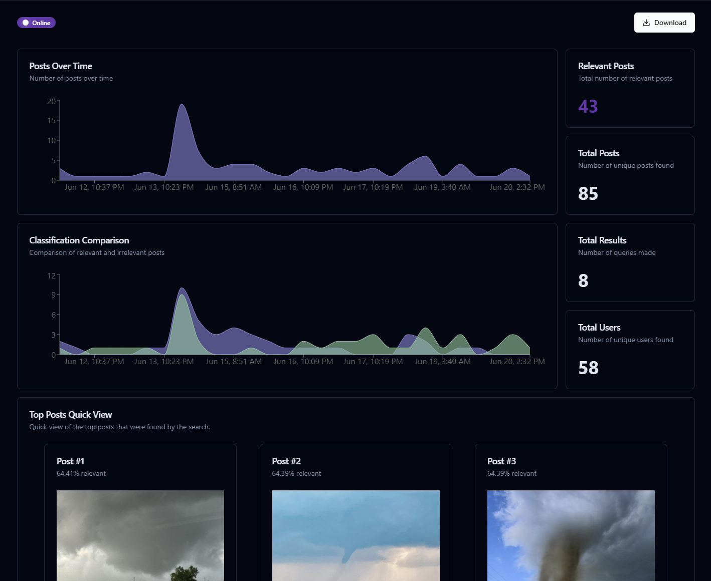
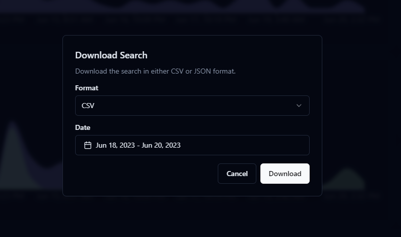

## NTP Social (no longer maintained)

NTP Social is a social media scrapping tool that utilized LLMs to scrape social media posts from Twitter, with the ability to add more sites. It will take these posts and grade them based on a classification model running on `co:here` that will determine the relevance of the post to the CSSL. The user can then view the posts and their grades, and can then choose to contact that user if future information is needed.

> `01` Social Dashboard

The dashboard is where you can view all of the current and past searches. You can also create a new search from here. The table also displays if the current search is enabled. If it is enabled, it will run based on the frequency defined in the search (every 6 to 48 hours).

> `02` Creating a New Search

Creating a new search is easy with the built in preset values. You can also choose to create a custom search with your own values. The search will be saved and can be viewed in the dashboard.

- **Search Name**: The name of the search. This will be displayed in the dashboard.
- **Date Range**: The date range of the search. This will be the date range of the posts that are scraped and how long the scraper will run.
- **Keywords**: The keywords that will be used to search for posts. The scraper will search for posts that contain these keywords.
- **Negative Keywords**: The negative keywords that will be used to search for posts. The scraper will not search for posts that contain these keywords.
- **Frequency**: The frequency of the search. This will determine how often the scraper will run.
- **Max Results**: The maximum number of results that will be scraped. The scraper will stop once this number is reached.
- **Location**: Using the map marker, location based keywords will be added to the search. The scraper will search for posts that contain these keywords.

> `03` Viewing a Search

The search page is where you can view the posts that were scraped from the search. You can also view the search details and where posts are being found. The table of posts is where you will be able to view the posts and their scores. You can also view them on their respective sites.

> `04` Downloading Posts

You can download the posts from the search as a CSV or JSON file. This will download all of the posts that were scraped from the search given the time frame you select. Using the flag feature is helpful so that you can create code to either exclude or invert the categorization of the posts.

By downloading the posts, you can continue to train the ML model for the app or create validation sets for the model as well.

